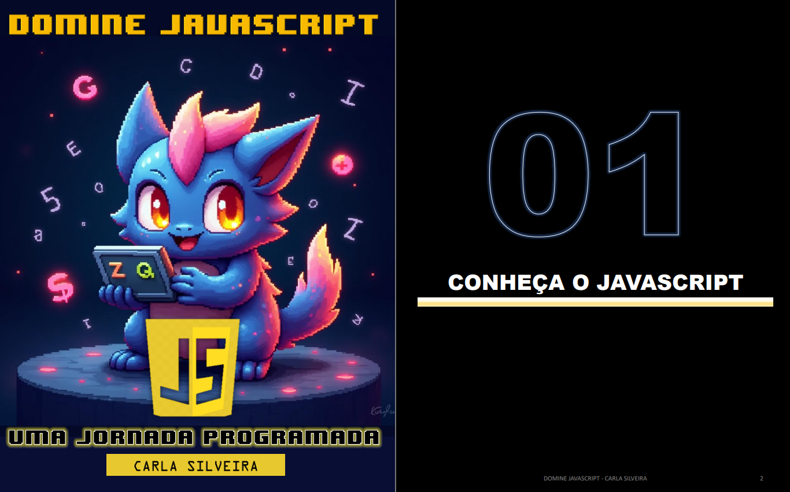
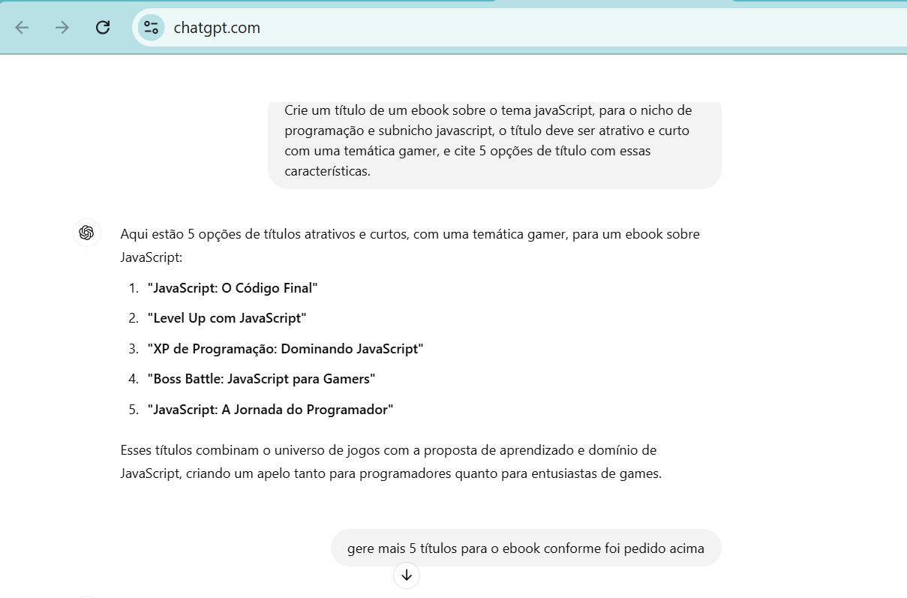
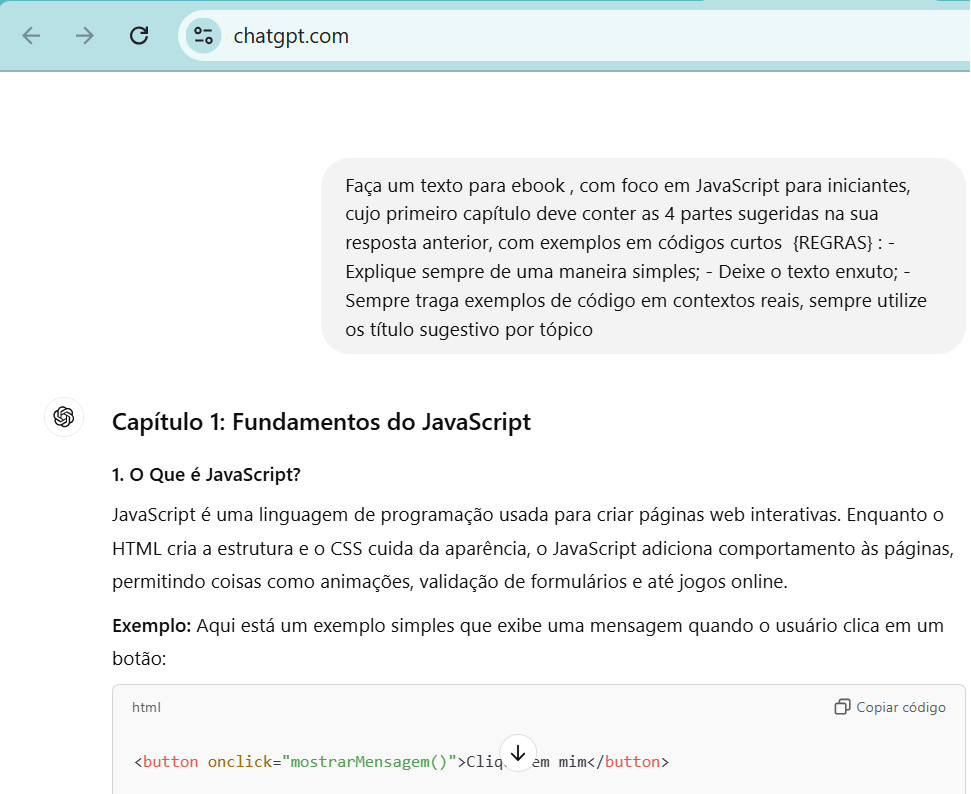
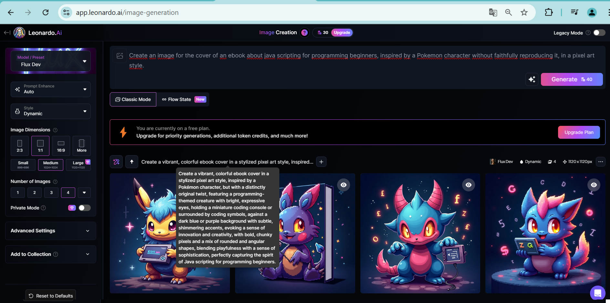

    

-------

---  

# Projeto EBOOK Gerado por Inteligência Artificial

 > ℹ️ **NOTE:** Este é o repositório desenvolvido durante o curso "Criando um Ebook com ChatGPT & MidJourney" na plataforma da [DIO](https://dio.me)

Projeto com o objetivo de gerar um ebook digital com as facilidades das ferramentas de IA.

<a href="https://github.com/rosacarla/prompts-recipe-to-create-a-ebook/blob/main/output/ebook-javascript.pdf" title="View PDF now"> 📕Clique aqui para ler</a>  

---  

## 💻 Tecnologias utilizadas no projeto

- [ChatGPT](https://chat.openai.com/) 
- [Leonardo.Ai](https://app.leonardo.ai/image-generation)
- [PowerPoint](https://www.microsoft.com/en/microsoft-365/powerpoint)  
- [Snappify](https://snappify.com/editor)  

---  

## 🧠 Prompts

ChatGPT：

     

Leonardo.Ai：

  

---  

## ✨ Features

- Conteúdo gerado via ChatGPT
- Imagens geradas via Leonardo.Ai  

---  

## 📚 Materiais

- Imagens utilizadas em `assets`
- Ebook gerado durante o curso em `output`  

---  

## 👨‍💻 Expert

[Carla Silveira](https://github.com/rosacarla)  

---  
